# workshop-spring-boot-mongodb


## Descrição

Este repositório é uma cópia (com algumas atualizações) do repositório [workshop-springboot2-mongodb](https://github.com/acenelio/workshop-springboot2-mongodb) de [acenelio](https://github.com/acenelio), feito em seu curso [Java COMPLETO 2023 Programação Orientada a Objetos +Projetos](https://www.udemy.com/course/java-curso-completo/).

Este projeto é uma API REST que oferece um conjunto de operações CRUD para usuários e posts. Cada usuário pode criar posts e esses posts podem ter comentários associados a eles. 

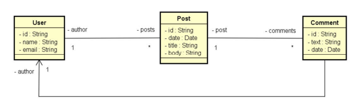
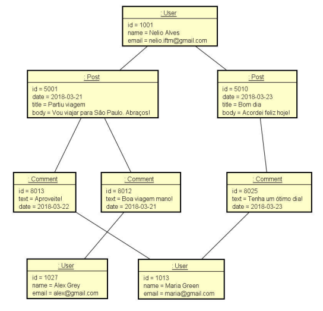

## Pré-requisitos

- Java 8 ou superior
- MongoDB


## Configuração

Em `src/main/resources/application.properties`, defina a uri do mongodb:

```properties
spring.data.mongodb.uri=mongodb://localhost:27017/workshop_mongo
```


## Como executar o projeto

1. Inicie o MongoDB no seu prompt de comandos: `mongod`
2. Execute o Spring Boot App: `src/main/java/com/kauassilva/workshopmongo/WorkshopmongoApplication.java`
3. Para encerrar o MongoDB pressione dentro do prompt de comandos: `Ctrl` + `C`


## API Endpoints

### User

- `GET /api/users`: Retorna uma lista de todos os usuários.
  
  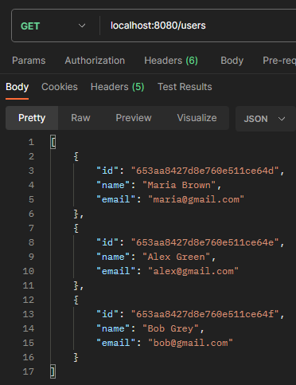

- `GET /api/users/{id}`: Retorna os detalhes do usuário com o ID especificado.

  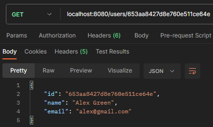

- `POST /api/users`: Cria um novo usuário. O corpo da solicitação deve conter os detalhes do usuário (name e email).

  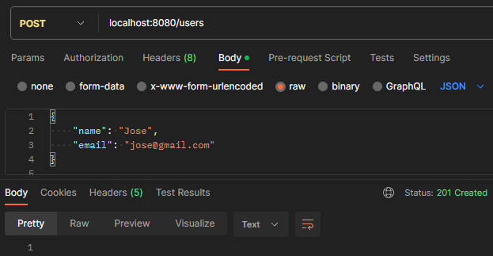
  
- `DELETE /api/users/{id}`: Exclui o usuário com o ID especificado

  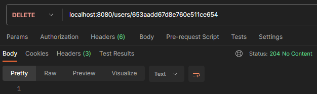

- `PUT /api/users/{id}`: Atualiza o usuário com o ID especificado. O corpo da solicitação deve conter os novos detalhes do usuário (name e email).

  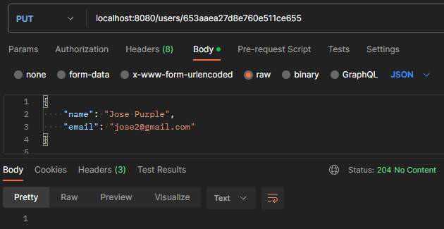

- `GET /api/users/{id}/posts`: Retorna uma lista de todos os posts do usuário com o ID especificado.

  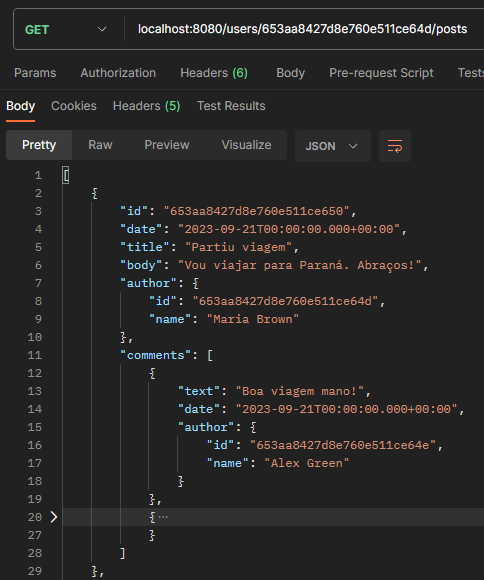

### Post

- `GET /api/posts/{id}`: Retorna o post com o ID especificado.

  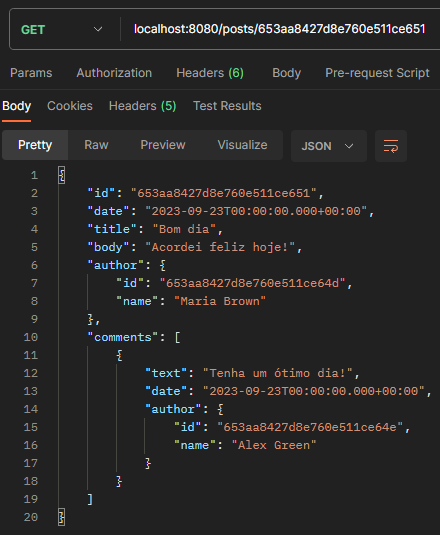

- `GET /api/posts/titlesearch?text`: Retorna uma lista de todos os posts com o título especificado no cabeçalho da requisição (text).

  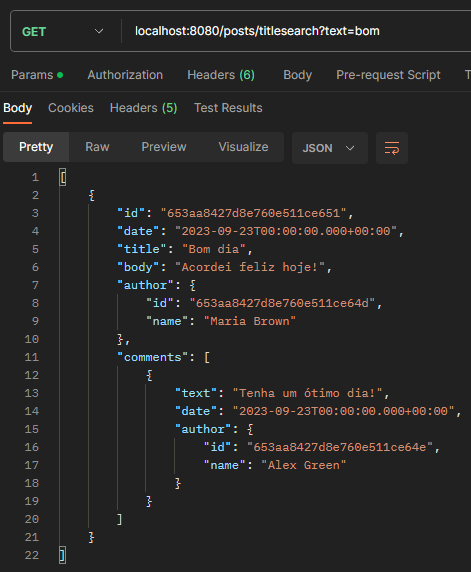
  
- `GET /api/posts/fullsearch?text&minDate&maxDate`: Retorna uma lista de todos os posts com os parâmetros atendidos no cabeçalho da requisição (text, minDate, maxDate).

  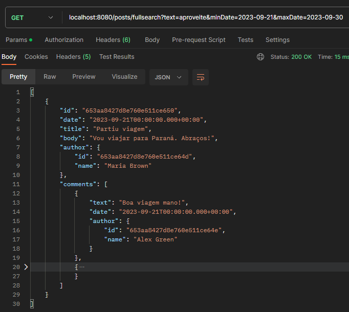
